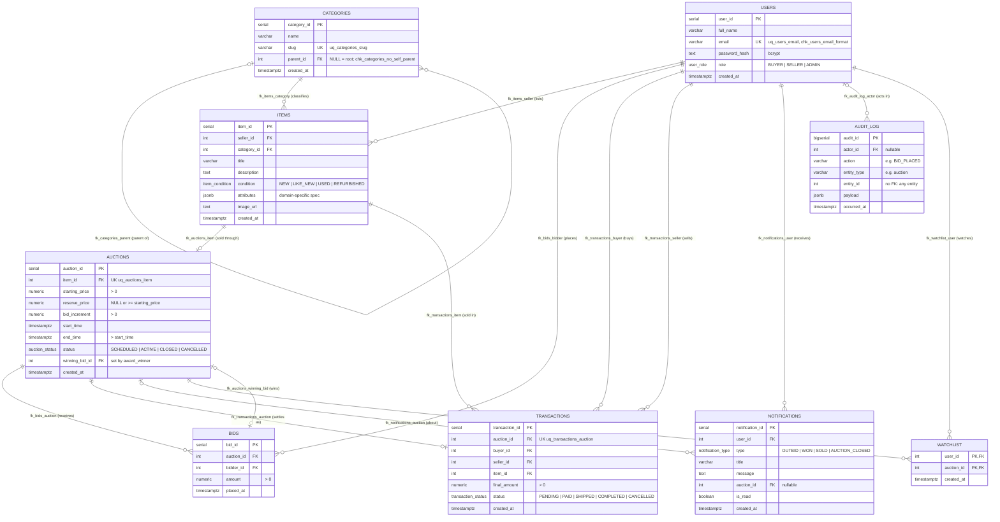
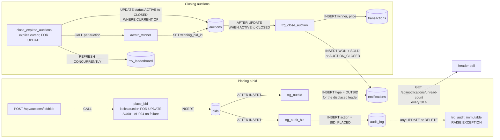

# ER diagram and trigger flow

Drawn from `db/01_schema.sql` (tables, keys, constraints) and `db/02_triggers.sql` /
`db/03_procedures.sql` (the event flow). Column-level detail is in
[data-dictionary.md](data-dictionary.md); the design reasoning is in
[normalization.md](normalization.md).

## 1. Entity-relationship diagram

Nine tables, sixteen foreign keys. Crow's-foot notation: `||` exactly one, `o|` zero or
one, `o{` zero or many. Every foreign key in the schema appears once below, labelled with
its constraint name.

### Reading the cardinalities

| Relationship | Why this cardinality |
|---|---|
| category → parent category | `parent_id` is nullable: a root has no parent, every other category has exactly one. Any depth is possible. |
| item → auction, **0..1** | `uq_auctions_item`: an item is auctioned at most once. Relisting means a new item row. |
| auction → transaction, **0..1** | `uq_transactions_auction`: a sale settles exactly once, even if two sessions close the auction together. |
| auction → winning bid, **0..1** | `winning_bid_id` is NULL until `award_winner()` runs, and stays NULL with no bids or when the reserve is not met. |
| auction ↔ bids | This is a cycle: bids reference auctions, and an auction references its winning bid. `fk_auctions_winning_bid` is therefore added with `ALTER TABLE` after `bids` exists. |
| notification → auction, **0..1** | Every notification today is about an auction, but the column is nullable so account-level messages remain possible. |
| audit row → actor, **0..1** | `actor_id` is nullable (`ON DELETE SET NULL`). `entity_id` has **no** foreign key: the log must be able to point at any table and outlive the row it describes. |
| user ↔ auction (watchlist) | A many-to-many junction table; the composite primary key stops a user from watching the same auction twice. |

### Delete behaviour

| Foreign key | On delete | Effect |
|---|---|---|
| `fk_bids_auction`, `fk_notifications_*`, `fk_watchlist_*` | CASCADE | Rows that only make sense with their parent go with it. |
| `fk_auctions_winning_bid`, `fk_audit_log_actor` | SET NULL | The parent survives and just loses the link. |
| every other foreign key | RESTRICT | History (listings, bids, sales) can't be deleted out from under a user, item or category. |

`audit_log` is append-only (`trg_audit_immutable`), so the UPDATE that `SET NULL` would
perform is itself refused. In practice, any user who appears in the audit log can't be
deleted.

## 2. Trigger and procedure flow

This is the architecture in one picture. The application does two things: it calls
`place_bid()`, and it calls `close_expired_auctions()` on a timer. Every other write in this
diagram is done by the database itself.

### The bid → notification path in words

1. The API calls `place_bid(user, auction, amount)`. The procedure locks the auction row
   (`FOR UPDATE`). It checks that the auction exists (AU004), that it is open (AU002), that
   the bidder is not the seller (AU003), and that the amount is at least the high bid plus
   the increment (AU001). Then it inserts one row into `bids`.
2. That INSERT fires two `AFTER INSERT` triggers on `bids`:
   - `trg_outbid` finds the best earlier bid by a *different* bidder, the person just
     displaced, and inserts an `OUTBID` notification for them;
   - `trg_audit_bid` appends a `BID_PLACED` row to `audit_log` with the bid's id, amount
     and time.
3. Everything above is one transaction. If any step fails, the bid, the notification and
   the audit row all roll back together.
4. The displaced bidder's header bell polls `unread-count` and goes up by one. No
   application code wrote that notification.

### The close path in words

1. `close_expired_auctions()` opens a cursor over `ACTIVE` auctions whose `end_time` has
   passed, locking each row as it is fetched.
2. For each row it runs `UPDATE ... SET status = 'CLOSED' WHERE CURRENT OF` the cursor. That
   status flip fires `trg_close_auction`, which:
   - writes the `transactions` row and the `WON` / `SOLD` notifications if there is a
     winning bid that meets the reserve;
   - otherwise writes a single `AUCTION_CLOSED` notification to the seller.
3. `award_winner()` then stamps `auctions.winning_bid_id`, and after the loop the procedure
   refreshes `mv_leaderboard` concurrently, so readers are never blocked.

A manual `UPDATE auctions SET status = 'CLOSED'` fires the same trigger. Settlement doesn't
depend on which code path closed the auction.
